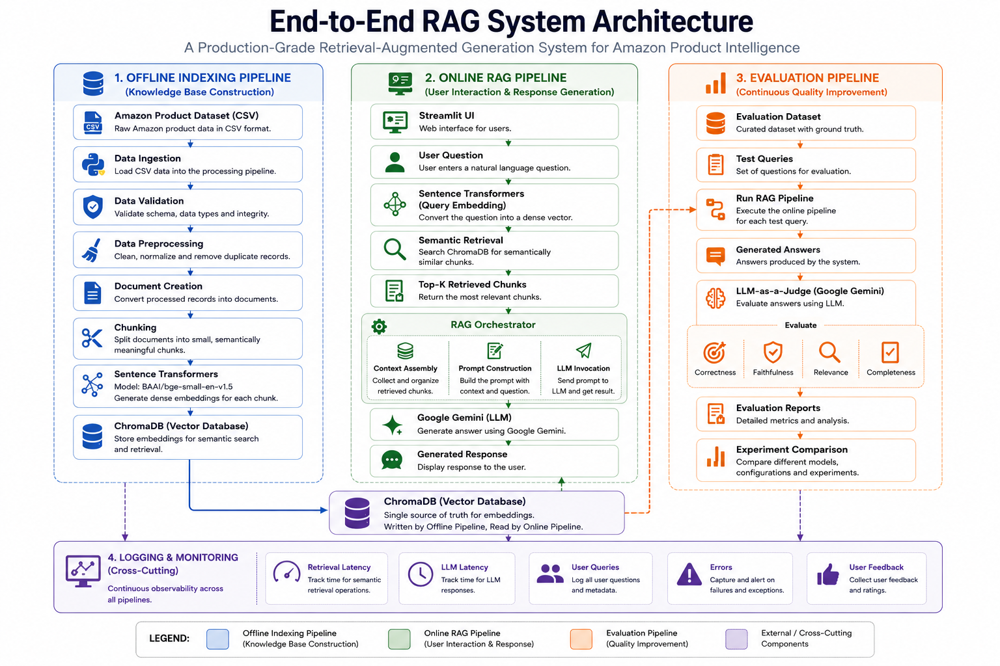

# Amazon Product Intelligence Assistant

> An end-to-end Retrieval-Augmented Generation (RAG) application that enables users to explore Amazon products and customer reviews using natural language. Built as part of **LLM Zoomcamp** with a strong emphasis on **Data Engineering**, **AI Engineering**, and **production-ready software design**.

---

# Project Overview

The **Amazon Product Intelligence Assistant** is an AI-powered application that helps users interact with Amazon product information through natural language conversations.

Instead of manually reading product descriptions, specifications, ratings, and hundreds of customer reviews, users can ask questions such as:

- *Is this laptop good for programming?*
- *What are the common complaints about this product?*
- *Compare these two headphones.*
- *Summarize customer opinions.*

The application uses **Retrieval-Augmented Generation (RAG)** to retrieve relevant product information from a vector database before generating grounded responses using a Large Language Model (LLM).

This project is designed as a **portfolio-quality engineering project**, demonstrating the complete lifecycle of building a production-style RAG system—from data ingestion and preprocessing to retrieval, evaluation, monitoring, and deployment.

---

# Project Goals & Scope

## Project Goals

The primary goals of this project are to:

- Build a complete end-to-end Retrieval-Augmented Generation (RAG) application.
- Demonstrate production-style AI and Data Engineering practices.
- Meet the evaluation criteria of the LLM Zoomcamp course.
- Create a modular, maintainable, and reproducible codebase.
- Showcase semantic search, vector databases, and LLM integration.
- Develop a portfolio-quality project suitable for technical interviews.

---

## In Scope

The MVP includes:

- Dataset ingestion
- Data preprocessing
- Document creation
- Document chunking
- Embedding generation
- Vector database indexing
- Semantic retrieval
- Retrieval-Augmented Generation
- Streamlit user interface
- Retrieval evaluation
- Prompt evaluation
- Monitoring and logging
- Dockerized application
- Reproducible project setup

---

## Out of Scope

The following features are intentionally excluded from the MVP:

- Multi-agent systems
- Autonomous workflows
- Fine-tuning language models
- Recommendation systems
- Real-time Amazon integration
- Cloud deployment
- Hybrid retrieval
- Re-ranking
- Conversation memory

These may be considered as future enhancements after the MVP is complete.

---

# Problem Statement

Modern e-commerce platforms contain an enormous amount of information spread across product descriptions, technical specifications, ratings, and customer reviews.

Although this information helps consumers make informed purchasing decisions, it also introduces a significant challenge: **information overload**.

Users often spend considerable time reading multiple product pages and hundreds of reviews before they can answer questions such as:

- Which product is better?
- What problems do customers commonly report?
- What features receive the most praise?
- Is this product suitable for my use case?

Traditional keyword-based search systems can retrieve documents that contain matching words, but they cannot understand user intent or synthesize information from multiple sources into a coherent answer.

This project addresses that problem by combining semantic retrieval with Large Language Models to provide grounded, context-aware responses.

---

# Business Objective

The objective of this project is to develop an AI-powered Product Intelligence Assistant that enables users to interact with Amazon product information using natural language.

The application helps users:

- Ask questions about products
- Compare products
- Summarize customer opinions
- Identify frequently praised features
- Discover common complaints
- Retrieve relevant supporting information

From an engineering perspective, the project demonstrates the implementation of a complete Retrieval-Augmented Generation (RAG) pipeline, including:

- Data ingestion
- Data preprocessing
- Document creation
- Chunking
- Embedding generation
- Vector indexing
- Semantic retrieval
- Prompt construction
- Response generation
- Evaluation
- Monitoring

---

# Key Features

- Natural language product search
- Semantic document retrieval
- Product comparison
- Customer review summarization
- Complaint analysis
- Frequently praised feature extraction
- Evidence-grounded AI responses
- Retrieval evaluation
- Prompt evaluation
- Interactive Streamlit interface
- Logging and monitoring

---

## System Architecture

The Amazon Product Intelligence Assistant follows a production-inspired architecture consisting of four logical components:

- Offline Indexing Pipeline
- Online RAG Pipeline
- Evaluation Pipeline
- Observability Layer

The offline pipeline transforms raw Amazon product data into a searchable vector knowledge base.

The online pipeline retrieves semantically relevant documents and generates grounded responses using Google Gemini.

The evaluation pipeline measures retrieval and generation quality using LLM-as-a-Judge.

The observability layer captures metrics, logs, and user feedback to support debugging and continuous improvement.



---

# Project Structure

```text
amazon-product-intelligence/

├── app/
├── config/
├── data/
├── docs/
├── logs/
├── notebooks/
├── scripts/
├── src/
├── tests/
├── Dockerfile
├── pyproject.toml
├── README.md
└── uv.lock
```

## Directory Overview

| Directory | Purpose |
|------------|---------|
| `app/` | Streamlit application |
| `config/` | Configuration management and logging |
| `data/` | Raw, processed, and evaluation datasets |
| `docs/` | Project documentation and architecture diagrams |
| `logs/` | Application logs |
| `notebooks/` | Exploratory data analysis and experiments |
| `scripts/` | Executable project scripts |
| `src/` | Core business logic |
| `tests/` | Unit and integration tests |

---

# Technology Stack

| Layer | Technology |
|---------|------------|
| Programming Language | Python 3.12+ |
| Package Manager | uv |
| Data Processing | Pandas |
| Notebook Environment | Jupyter |
| Embedding Model | BAAI/bge-small-en-v1.5 |
| Vector Database | ChromaDB |
| Large Language Model | Google Gemini |
| UI Framework | Streamlit |
| Configuration | python-dotenv |
| Logging | Python logging |
| Version Control | Git + GitHub |
| Containerization | Docker |

---

# Data Pipeline

The offline pipeline transforms the raw Amazon dataset into a searchable knowledge base.

```text
Amazon Dataset
      │
      ▼
Load Dataset
      │
      ▼
Clean Dataset
      │
      ▼
Create Documents
      │
      ▼
Chunk Documents
      │
      ▼
Generate Embeddings
      │
      ▼
Store in ChromaDB
```

---

# RAG Pipeline

The online pipeline processes user queries using Retrieval-Augmented Generation.

```text
User Query
      │
      ▼
Generate Query Embedding
      │
      ▼
Semantic Retrieval
      │
      ▼
Retrieve Top-K Chunks
      │
      ▼
Prompt Builder
      │
      ▼
Google Gemini
      │
      ▼
Grounded Response
```

---

# Installation

Clone the repository.

```bash
git clone <repository-url>

cd amazon-product-intelligence
```

Install project dependencies.

```bash
uv sync
```

---

# Configuration

Create a `.env` file from `.env.example`.

Required environment variables:

```env
GEMINI_API_KEY=your_api_key_here
```

Additional configuration options will be documented as the project evolves.

---

# Running the Project

The application will be executed using the following workflow.

### Build the knowledge base

```bash
uv run python scripts/ingest.py

uv run python scripts/build_index.py
```

### Launch the application

```bash
streamlit run app/streamlit_app.py
```

### Run evaluation

```bash
uv run python scripts/evaluate.py
```

---

# Evaluation

The project evaluates both retrieval quality and response quality.

Planned evaluation includes:

- Retrieval relevance
- Chunking strategy comparison
- Prompt comparison
- Embedding model evaluation
- Generated answer quality

Evaluation results will be documented in future project updates.

---

# Project Roadmap

- [x] Repository setup
- [x] Project architecture
- [x] Technology selection
- [ ] Dataset exploration
- [ ] Data preprocessing
- [ ] Document creation
- [ ] Chunking
- [ ] Embedding generation
- [ ] Vector database
- [ ] Semantic retrieval
- [ ] RAG pipeline
- [ ] Streamlit interface
- [ ] Monitoring
- [ ] Evaluation
- [ ] Docker
- [ ] Final documentation

---

# Future Improvements

Potential enhancements after completing the MVP include:

- Hybrid retrieval (BM25 + Vector Search)
- Re-ranking
- Query rewriting
- Multi-vector retrieval
- Multi-modal RAG
- Conversation memory
- FastAPI backend
- Cloud deployment
- Authentication
- CI/CD pipeline

---

# References

- LLM Zoomcamp
- Amazon Product & Review Dataset
- Google Gemini API
- Sentence Transformers
- ChromaDB
- Streamlit
- Pandas
- Python

---

# License

This project is released under the **MIT License**.