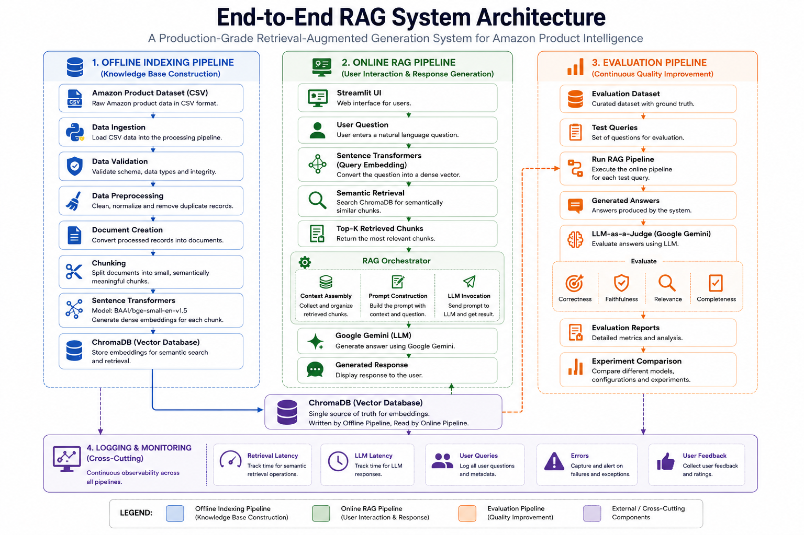

# 🛍️ Amazon Fashion Product Intelligence System

> An end-to-end Retrieval-Augmented Generation (RAG) application that enables Product Managers, Brand Managers, Category Managers, and E-commerce Analysts to explore Amazon Fashion products using natural language instead of manually analyzing thousands of product listings and customer reviews.

The system combines **Hybrid Retrieval (Dense + BM25)**, **Large Language Models**, **Monitoring**, and **Evaluation** to generate accurate, grounded answers from Amazon Fashion product data.

---

🎯 Business Problem
Product managers and brand managers often need to analyze hundreds of product listings and thousands of customer reviews to understand customer sentiment, compare competitors, identify product strengths and weaknesses, and make pricing or merchandising decisions. Manual analysis is time-consuming and difficult to scale.

The Amazon Fashion Product Intelligence System addresses this challenge by combining Retrieval-Augmented Generation (RAG) with hybrid search to provide accurate, evidence-grounded answers from product metadata and customer reviews using natural language.
---

# ✨ Project Highlights

- End-to-End Production-style RAG Pipeline
- Hybrid Retrieval (Dense Embeddings + BM25 + Reciprocal Rank Fusion)
- Semantic Search using Sentence Transformers
- Chroma Vector Database
- Gemini-powered Answer Generation
- Modular & Maintainable Architecture
- Prompt Strategy Framework
- LLM-as-a-Judge Evaluation
- Monitoring Dashboard with Telemetry Metrics
- Interactive Streamlit Chat Interface

---

# 🏗️ System Architecture



---

# 📂 Repository Structure

```text
amazon-product-intelligence/
│
├── config/                 # Configuration files
├── data/
│   ├── raw/
│   ├── processed/
│   └── chroma/
│
├── docs/
│   ├── architecture/
│   └── adr/
│
├── outputs/
│   ├── evaluation/
│   ├── monitoring/
│   └── ground_truth/
│
├── src/
│   ├── preprocessing/
│   ├── document_builder/
│   ├── chunking/
│   ├── embeddings/
│   ├── indexing/
│   ├── retrieval/
│   ├── context_builder/
│   ├── prompt_builder/
│   ├── llm/
│   ├── pipeline/
│   ├── monitoring/
│   └── evaluation/
│
├── ui/
│   ├── app.py
│   └── monitoring.py
│
└── README.md
```

---

# ⚙️ Quick Start

## Clone the Repository

```bash
git clone <repository-url>
cd amazon-product-intelligence
```

## Install Dependencies

```bash
uv sync
```

## Configure Environment Variables

Create a `.env` file.

```env
GEMINI_API_KEY=YOUR_GEMINI_API_KEY
```

## 1. Preprocess the Dataset

```bash
python -m src.scripts.preprocess_data
```

This cleans and standardizes the raw Amazon Fashion dataset.

---

## 2. Build the Vector & BM25 Indexes

```bash
python -m src.indexing.run
```

This:

- Generates product documents
- Chunks documents
- Creates embeddings
- Builds the Chroma vector database
- Builds the BM25 index

> **Note:** This step only needs to be run once or whenever the dataset changes.

## 4. Launch the Chat Application

```bash
PYTHONPATH=. uv run streamlit run ui/app.py
```

---

## 5. Launch the Monitoring Dashboard

```bash
PYTHONPATH=. uv run streamlit run ui/monitoring.py
```

### Evaluation
## Generate Ground Truth

```bash
python -m src.evaluation.ground_truth.run
```

---

## Run LLM Evaluation

```bash
python -m src.evaluation.llm.run
```

---

## Generate Evaluation Report

```bash
python -m src.evaluation.evaluator.run
```

---

# 📚 Documentation

| Document | Description |
|-----------|-------------|
| `docs/architecture/system-architecture.png` | Complete system architecture |
| `docs/architecture/system-design.md` | High-level design and component interactions |
| `docs/architecture/rag-pipeline.md` | End-to-end RAG pipeline workflow |
| `docs/adr/ADR-001-Hybrid-Retrieval.md` | Architectural Decision Record for Hybrid Retrieval |
| `docs/adr/ADR-002-Embedding-Model.md` | Embedding model selection rationale |

---

# 🛠️ Technologies

### Programming

- Python 3.12

### LLM

- Google Gemini

### Embeddings

- Sentence Transformers
- BAAI/bge-small-en-v1.5

### Retrieval

- ChromaDB
- BM25
- Reciprocal Rank Fusion

### User Interface

- Streamlit

### Data Processing

- Pandas
- NumPy

### Monitoring & Visualization

- Plotly
- Streamlit Dashboard

### Evaluation

- LLM-as-a-Judge
- Prompt Strategy Evaluation

### Development

- uv
- Git
- VS Code