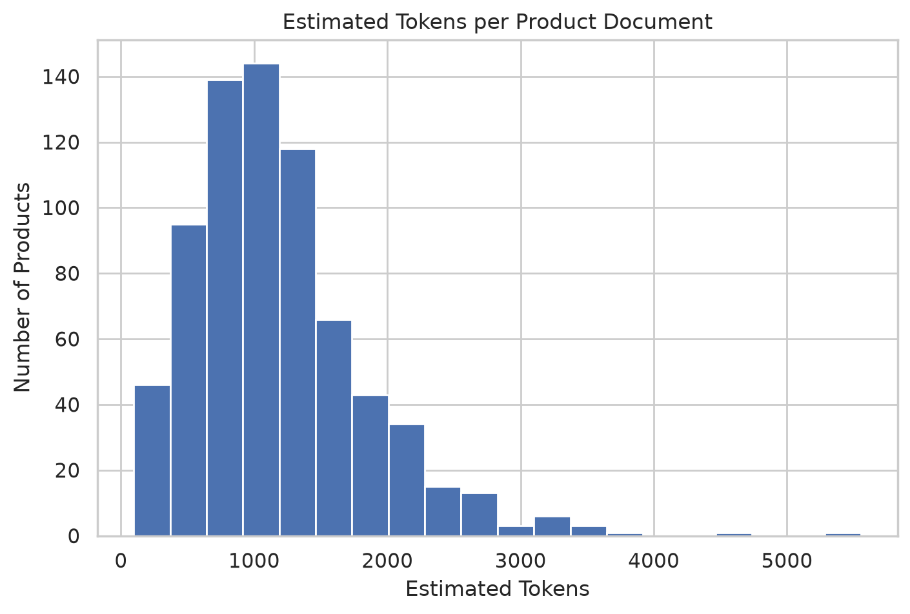

# ADR-003: Chunking Strategy

**Status:** Accepted  
**Date:** 2026-07-16

## Context

After generating prototype product documents, we measured document sizes to determine an appropriate chunking strategy.

### Document Statistics

| Metric | Value |
|---------|------:|
| Documents | 728 |
| Mean Tokens (estimated) | 1,179 |
| Median Tokens (estimated) | 1,073 |
| 75th Percentile | 1,465 |
| Maximum | 5,557 |

The analysis showed that while most documents are moderately sized, some exceed the embedding model's context window.

---

## Decision

Chunking will be performed using the **embedding model's tokenizer**, not character or word counts.

The chunking implementation will:

- Use the tokenizer associated with the embedding model (`BAAI/bge-small-en-v1.5`)
- Respect the model's maximum sequence length
- Generate overlapping chunks to preserve contextual continuity
- Operate after Rich Document creation and before embedding generation

---

## Rationale

Character-based heuristics do not accurately reflect how BERT-based embedding models tokenize text.

Using the embedding model's tokenizer ensures:

- No silent truncation
- Consistent chunk boundaries
- Maximum semantic preservation
- Portability across embedding models

---

## Evidence

Document Size Distribution

---

## Consequences

### Advantages

- Chunk sizes align with model constraints
- More reliable embeddings
- Improved retrieval quality
- Embedding-model-aware preprocessing

### Trade-offs

- Slightly more preprocessing complexity
- Requires tokenizer initialization during chunk generation

---
