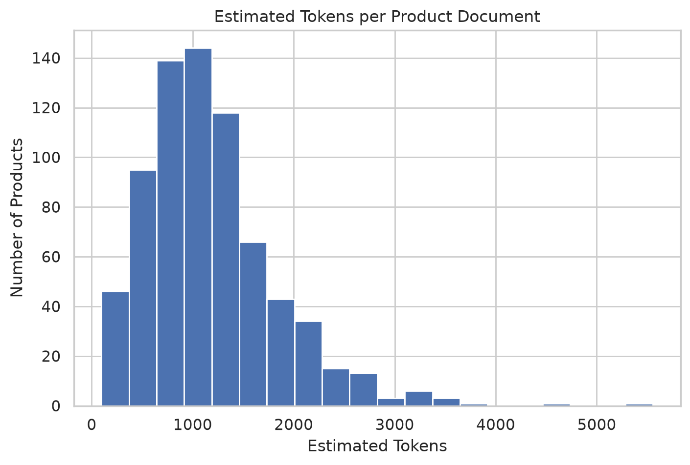

# ADR-003: Chunking Strategy

**Status:** Accepted  
**Date:** 2026-07-16

---

# Context

After generating rich product documents, we analyzed their sizes to determine an appropriate chunking strategy before embedding generation.

## Document Statistics

| Metric | Value |
|---------|------:|
| Documents | 728 |
| Mean Tokens (estimated) | 1,179 |
| Median Tokens (estimated) | 1,073 |
| 75th Percentile | 1,465 |
| Maximum | 5,557 |

The analysis revealed two distinct groups:

- **Most product documents (≈90–95%)** contain approximately **800–1,500 tokens**.
- **A small number of popular products** contain significantly more reviews, producing documents up to **5,557 tokens**.

This distribution indicates that while most documents are moderate in size, a minority exceed the optimal input size for embedding generation and therefore require chunking.

---

# Decision

Chunking will be performed using the **embedding model's tokenizer**, rather than character or word counts.

The chunking pipeline will follow a **hierarchical strategy**:

```
Rich Document
        │
        ▼
Section-aware Split
        │
        ▼
Tokenizer-aware Chunking
        │
        ▼
Embedding Generation
```

The implementation will:

- Use the tokenizer associated with the embedding model (`BAAI/bge-small-en-v1.5`)
- Preserve logical document sections whenever possible
- Split oversized sections using token-aware chunking
- Generate overlapping chunks to preserve contextual continuity
- Operate after Rich Document generation and before embedding generation
- Preserve parent document metadata for every generated chunk

---

# Chunking Strategy

The rich documents already contain clear semantic sections:

- Product Information
- About This Item
- Customer Reviews

Instead of chunking the entire document as plain text, the chunker will first preserve these semantic boundaries.

If a section exceeds the target chunk size, it will be recursively divided using the embedding tokenizer.

This approach maintains semantic coherence while keeping chunks within the embedding model's optimal input size.

---

# Initial Chunk Configuration

The initial production configuration will be:

| Parameter | Value |
|-----------|------:|
| Chunk Size | 384 tokens |
| Chunk Overlap | 64 tokens |

These values were selected based on the measured document distribution and may be refined through retrieval evaluation.

---

# Chunk Metadata

Each generated chunk will inherit metadata from its parent document.

Example:

```python
{
    "chunk_id": "B0018ON68A_chunk_003",
    "asin": "B0018ON68A",
    "brand_name": "...",
    "category": "...",
    "chunk_index": 3,
    "chunk_type": "customer_reviews"
}
```

Using deterministic chunk identifiers simplifies debugging, evaluation, and retrieval analysis.

---

# Rationale

Character- and word-based heuristics do not accurately represent how transformer embedding models tokenize text.

Using the embedding model's tokenizer provides:

- Accurate token accounting
- No silent truncation
- Consistent chunk boundaries
- Maximum semantic preservation
- Portability across embedding models

Preserving semantic document sections before token-based splitting further improves retrieval quality by reducing unrelated information within individual chunks.

---

# Evidence

## Document Size Distribution



---

# Consequences

## Advantages

- Chunk sizes align with embedding model constraints
- Preserves semantic document structure
- Improves retrieval precision
- Prevents silent truncation
- Supports deterministic chunk generation
- Rich metadata enables filtering, debugging, and evaluation
- Embedding-model-aware preprocessing

## Trade-offs

- Slightly more preprocessing complexity
- Requires tokenizer initialization during chunk generation
- Requires section-aware parsing before token splitting

---